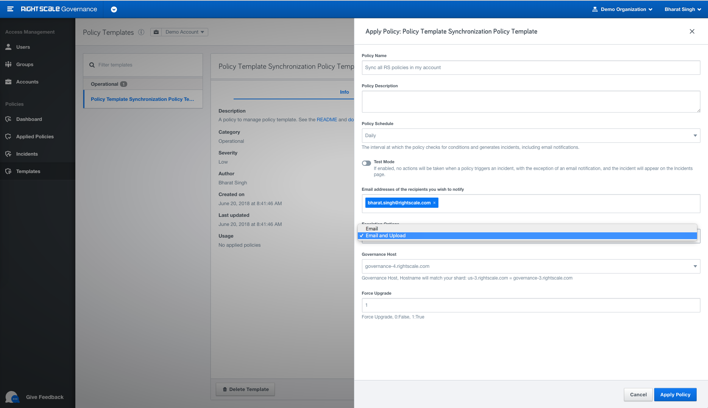

## Plugin Synchronization Tool

### What it does

This Policy Template can be used to synchronize (upload, overwrite, or alert) built-in plugins in your account. It uses a json file stored in the GitHub repository to determine a set of Flexera's current plugins and then compares them with your current account plugins (using the version) to take appropriate action.

### Parameters

1. Email Addresses - Email addresses of the recipients you wish to notify - Ex: noreply@example.com, ...
2. Force Upgrade - Allowed Values: 0:False, 1:True - Setting this to 1 will force upgrade all plugins in your account.

### Required Roles

- `policy_manager` or `policy_designer`
